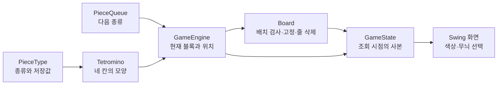

# 보드와 블록: 데이터와 사용 방법

보드는 **고정된 칸**, 블록은 **종류와 모양**을 관리한다. 이동 중인 블록의 위치는 게임 엔진이
별도로 보관한다. 화면은 이 세 정보를 함께 사용해 게임을 그린다.

먼저 전체 역할을 확인한 뒤 좌표 예시와 클래스별 메서드를 읽으면 된다.
엔진을 통해 게임 전체를 조작하는 방법은 [게임 엔진 연결 문서](game-engine.md)에 설명한다.

## 1. 클래스가 맡는 일

| 클래스 | 맡는 일 | 보관하는 정보 |
|---|---|---|
| `Board` | 배치 검사, 블록 고정, 완성된 줄 삭제 | 20행 10열의 고정된 칸 |
| `PieceType` | 일곱 종류와 칸 저장값의 대응 | I·O·T·S·Z·J·L과 값 1~7 |
| `Tetromino` | 블록의 모양과 시계방향 회전 | 종류, 내부 좌표 네 개, 회전 기준 크기 |
| `PieceQueue` | 다음 블록 선택과 미리보기 | 생성 예정 종류의 순서 |



색상 설정을 바꿔도 보드 값은 그대로이다. 보드와 블록 클래스에는 화면의 색상이나 그림 그리기
기능이 들어 있지 않다.

## 2. 좌표는 어떻게 읽을까?

행은 위에서 아래로, 열은 왼쪽에서 오른쪽으로 증가한다. 왼쪽 위 칸은 `[0, 0]`이다.
보드 행은 0~19, 열은 0~9이다. 코드에서는 `row`, `column`을 사용한다.

`Tetromino.cells()`는 **블록 내부 좌표**를 반환한다. 엔진의 기준 행·열은 회전 기준 정사각형의
왼쪽 위가 놓이는 보드 위치이다. 둘을 더해야 화면에 그릴 실제 칸 위치가 된다.

```text
실제 보드 행 = 기준 행 + 내부 행
실제 보드 열 = 기준 열 + 내부 열

T 블록의 내부 좌표             기준 위치가 [5, 3]일 때 보드 좌표

    열 0 1 2                  내부 [0, 1] → 보드 [5, 4]
행 0   . T .                  내부 [1, 0] → 보드 [6, 3]
행 1   T T T                  내부 [1, 1] → 보드 [6, 4]
행 2   . . .                  내부 [1, 2] → 보드 [6, 5]
```

좌표 배열은 행이 작은 순서, 같은 행에서는 열이 작은 순서로 정렬된다. 점은 블록이 차지하지 않는
칸이다. 빈 부분을 포함한 정사각형 전체를 고정하거나 충돌 검사하지 않는다.

## 3. `PieceType`: 종류와 칸 저장값

| 값 | 의미 | 값 | 의미 |
|---|---|---|---|
| 0 | 빈 칸: `Board.EMPTY_CELL` | 4 | S |
| 1 | I | 5 | Z |
| 2 | O | 6 | J |
| 3 | T | 7 | L |

| 메서드 | 반환값과 처리 |
|---|---|
| `cellValue()` | 해당 종류의 고정 저장값 1~7 |
| `fromCellValue(int cellValue)` | 1~7에 대응하는 `PieceType` |

0은 블록 종류가 아니므로 변환하기 전에 빈 칸인지 확인한다. 0이나 범위를 벗어난 값을
`fromCellValue()`에 전달하면 `IllegalArgumentException`이 발생한다.

```java
import tetris.board.Board;
import tetris.piece.PieceType;

int cellValue = PieceType.T.cellValue();
PieceType type = PieceType.fromCellValue(cellValue);

assert cellValue == 3;
assert type == PieceType.T;
assert Board.EMPTY_CELL == 0;
```

화면은 빈 칸을 제외한 값에서 종류를 구한 뒤 선택한 색각 모드의 색상·무늬를 적용한다.
번호는 열거형의 선언 순서로 계산하지 않으므로, 기존 번호를 변경할 때는 보드 데이터와 화면의
대응 규칙을 함께 검토해야 한다. 색상 논의는 [관련 이슈](https://github.com/dark-ran/tetris-team-project/issues/4)에서 확인한다.

## 4. `Tetromino`: 모양과 회전

`new Tetromino(type)`은 초기 모양을 만든다. 생성한 객체의 모양은 이후 바뀌지 않는다.
회전하면 원래 블록을 유지한 채 새 객체를 반환한다.

| 메서드 | 반환값과 처리 |
|---|---|
| `type()` | 블록 종류. 회전해도 유지 |
| `rotationSize()` | 회전 기준 정사각형의 한 변 크기 |
| `cells()` | `[행, 열]` 네 쌍의 독립된 배열 사본 |
| `rotateClockwise()` | 시계방향 90도 회전한 새 블록 |

I는 4×4, O는 2×2, 나머지는 3×3 정사각형을 기준으로 회전한다.
초기 모양은 다음과 같다.

```text
I       O     T      S      Z      J      L
....    OO    .T.    .SS    ZZ.    J..    ..L
IIII    OO    TTT    SS.    .ZZ    JJJ    LLL
....          ...    ...    ...    ...    ...
....
```

회전은 `[행, 열]`을 `[열, 기준 크기 - 1 - 행]`으로 바꾼다. 회전 후 좌표를 왼쪽 위로 당기지
않으므로 같은 기준 위치에서 회전 중심을 유지할 수 있다. O는 회전해도 같은 칸을 차지한다.

```java
import java.util.Arrays;
import tetris.piece.PieceType;
import tetris.piece.Tetromino;

Tetromino original = new Tetromino(PieceType.T);
Tetromino rotated = original.rotateClockwise();

assert Arrays.deepEquals(original.cells(), new int[][] {{0, 1}, {1, 0}, {1, 1}, {1, 2}});
assert Arrays.deepEquals(rotated.cells(), new int[][] {{0, 1}, {1, 1}, {1, 2}, {2, 1}});
```

배치 가능 여부는 `Board`가 검사한다. `Tetromino`는 보드 위치를 이동시키거나 벽 충돌을 해결하지
않는다. `null` 종류로 생성하면 `NullPointerException`이 발생한다.

## 5. `Board`: 검사하고, 고정하고, 삭제하기

새 보드는 모든 칸이 0이다. `Board.ROWS`는 20, `Board.COLUMNS`는 10이다.
기존 코드의 `Board.COLS`는 호환용 상수이며 새 코드에서는 `COLUMNS`를 사용한다.

| 메서드 | 원본 변경 | 반환값과 실패 처리 |
|---|---|---|
| `reset()` | 모든 칸을 비움 | 반환값 없음 |
| `canPlace(piece, row, column)` | 없음 | 네 칸이 보드 안이고 비어 있으면 `true` |
| `lock(piece, row, column)` | 네 칸에 종류별 값 저장 | 배치 불가이면 예외, 부분 고정 없음 |
| `clearFullRows()` | 완성된 줄 삭제와 위쪽 줄 이동 | 삭제한 줄 수 |
| `snapshot()` | 없음 | 고정된 칸의 `int[][]` 사본 |
| `copy()` | 없음 | 독립적으로 변경할 수 있는 `Board` 사본 |

### 배치와 고정 예시

검사는 후보가 가능한지 확인하는 동작이다. 고정은 실제 보드에 값을 쓰는 동작이다.
이동 중인 블록을 매번 고정하면 안 된다. 게임에서는 엔진이 고정 시점을 판단한다.

```java
import tetris.board.Board;
import tetris.piece.PieceType;
import tetris.piece.Tetromino;

Board board = new Board();
Tetromino piece = new Tetromino(PieceType.T);

assert board.canPlace(piece, 5, 3);
board.lock(piece, 5, 3);
int[][] fixedCells = board.snapshot();

assert fixedCells[5][4] == 3;
assert fixedCells[6][3] == 3;
assert !board.canPlace(piece, 5, 3);
```

`lock()`은 먼저 네 칸을 모두 검사한다. 한 칸이라도 경계를 넘거나 기존 블록과 겹치면
`IllegalArgumentException`을 발생시키고 보드를 유지한다. `null` 블록을 검사하거나 고정하면
`NullPointerException`이 발생한다.

### 빈 부분과 보드 경계

숨겨진 행은 없다. 블록이 실제로 차지하는 칸은 모두 보드 안에 있어야 한다.
기준 위치는 빈 부분 때문에 음수일 수 있다. 예를 들어 초기 I의 내부 행은 모두 1이므로
기준 행 -1에 배치하면 실제 네 칸은 보드 행 0에 놓인다.

```java
import tetris.board.Board;
import tetris.piece.PieceType;
import tetris.piece.Tetromino;

Board board = new Board();
Tetromino piece = new Tetromino(PieceType.I);

assert board.canPlace(piece, -1, 0);
assert !board.canPlace(piece, -2, 0);
```

### 줄 삭제

열 10개가 모두 채워진 줄을 한 번에 삭제한다. 남은 줄의 순서와 저장값은 유지하고,
삭제된 줄 위의 줄을 내린다. 맨 위에 생긴 빈 줄은 0으로 채운다.

```text
삭제 전              삭제 후
부분 줄 A             빈 줄
부분 줄 B             부분 줄 A
완성된 줄             부분 줄 B
아래쪽 줄 C           아래쪽 줄 C
```

삭제할 줄이 없으면 0을 반환하고 보드를 유지한다. 엔진은 블록을 고정한 뒤 이 메서드를 호출한다.
삭제된 줄 수의 점수 계산은 앱 제어와 점수 시스템에서 수행한다.

### 사본을 사용하는 이유

배열 사본은 칸을 읽거나 화면에 그릴 때 사용한다. 보드 사본은 상태를 복사한 뒤 독립적인 계산이
필요할 때 사용할 수 있다. 어느 쪽을 수정해도 원본 보드는 바뀌지 않는다.

```java
import tetris.board.Board;
import tetris.piece.PieceType;
import tetris.piece.Tetromino;

Board original = new Board();
original.lock(new Tetromino(PieceType.O), 0, 0);

int[][] cells = original.snapshot();
cells[0][0] = 7;
Board copied = original.copy();
copied.reset();

assert original.snapshot()[0][0] == 2;
assert copied.snapshot()[0][0] == 0;
```

## 6. `PieceQueue`: 다음 블록과 미리보기

일곱 종류를 매번 같은 확률로 독립 선택한다. 같은 종류가 연속으로 나올 수 있다.
미리보기 조회는 생성 순서와 무작위 선택기의 상태를 바꾸지 않는다.

| 생성자·메서드 | 동작 |
|---|---|
| `PieceQueue()` | 기본 선택기로 다음 블록 한 개 준비 |
| `PieceQueue(randomGenerator)` | 지정한 선택기로 다음 블록 한 개 준비 |
| `PieceQueue(randomGenerator, previewCount)` | 지정한 개수만큼 미리 준비 |
| `next()` | 첫 종류를 반환하고 새 종류를 마지막에 추가 |
| `preview()` | 수정할 수 없는 다음 종류 목록 사본 |

목록의 첫 원소가 다음 생성 대상이다. `next()` 이후에도 목록 길이는 같다.
기존에 조회한 목록은 이후 생성의 영향을 받지 않는다.

```java
import java.util.List;
import java.util.Random;
import tetris.piece.PieceQueue;
import tetris.piece.PieceType;

PieceQueue queue = new PieceQueue(new Random(21L), 3);
List<PieceType> preview = queue.preview();
PieceType nextType = queue.next();

assert preview.size() == 3;
assert nextType == preview.getFirst();
assert queue.preview().size() == 3;
```

미리보기 개수가 1보다 작으면 `IllegalArgumentException`, 선택기가 `null`이면
`NullPointerException`이 발생한다. 새 게임에서는 새 목록을 만든다.

## 7. 화면에 연결하는 순서

한 번 조회한 `GameState`에서 보드 사본과 현재 블록·위치·다음 목록을 함께 읽는다.
먼저 고정된 칸을 그린 뒤 현재 블록을 별도로 그리면 된다.

```text
state.board().snapshot()
  → 값 0은 빈 칸
  → 값 1~7은 PieceType.fromCellValue(value)로 종류 확인
  → 화면의 색상·무늬 규칙으로 고정된 칸 그리기

state.currentPiece()
  → null이면 현재 블록 그리기 생략
  → cells()의 내부 좌표에 currentRow()와 currentColumn()을 더해 그리기

state.nextPieces()
  → 각 종류로 Tetromino를 생성해 초기 모양 그리기
```

색각 모드는 이 그리기 단계에서 적용한다. 이동·충돌 검사나 보드 값 변환에 색상을 사용하지 않는다.
화면에서 `state.board().lock()`을 호출해도 조회 사본만 바뀌므로 엔진을 조작할 수 없다.
실제 게임 변경은 `GameEngine.apply()`로 전달한다.

## 8. 변경할 때 함께 확인할 곳

| 변경 내용 | 구현과 연결 영향 | 확인할 테스트 |
|---|---|---|
| 블록별 저장값 | `PieceType`, 보드 값 변환, 화면 대응 | `PieceTypeTest`, `BoardTest` |
| 블록 모양·회전 중심 | `Tetromino`, 생성 위치, 엔진 회전 검사, 화면 좌표 | `TetrominoTest`, `GameEngineTest` |
| 줄 삭제 방식 | `Board.clearFullRows()`, 엔진의 삭제 결과, 점수 계산 | `BoardTest`, `GameEngineTest` |
| 무작위 선택 규칙 | `PieceQueue`, 생성 순서와 확률 요구사항 | `PieceQueueTest`, `GameEngineTest` |
| 미리보기 개수 | `PieceQueue` 생성자, 엔진 목록 공급자, 화면 배치 | `PieceQueueTest`, `GameEngineTest` |
| 색상·무늬 | 화면 표현 클래스와 설정 | 화면 표시와 접근성 검증 |

현재 `Board`, `Tetromino`, `PieceQueue`는 `final` 클래스이며 상속하지 않는다.
실제로 교체할 수 있는 객체와 아직 구현 변경이 필요한 확장은
[게임 엔진 확장 예시](game-engine.md#8-기능을-확장하는-방법)에서 구분한다.
