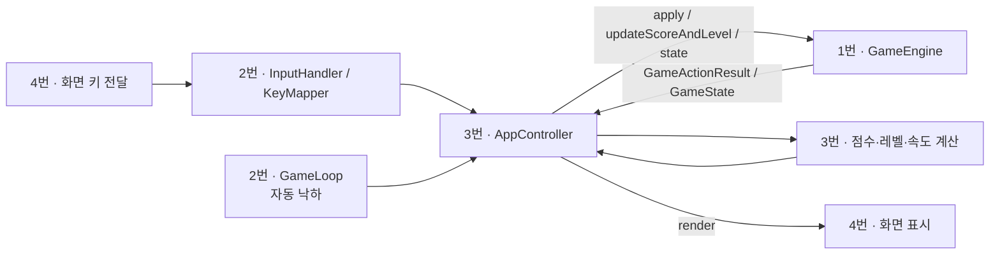
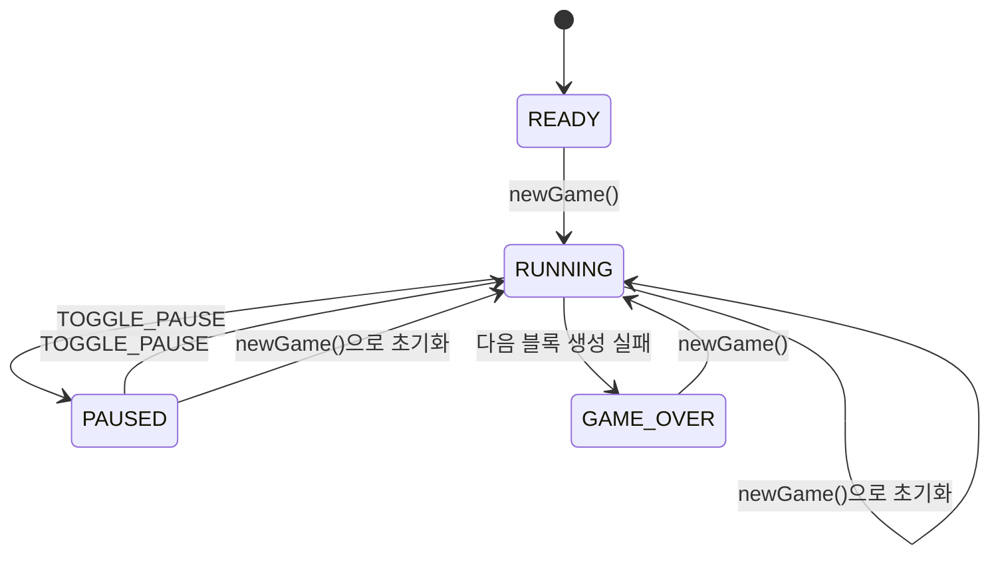
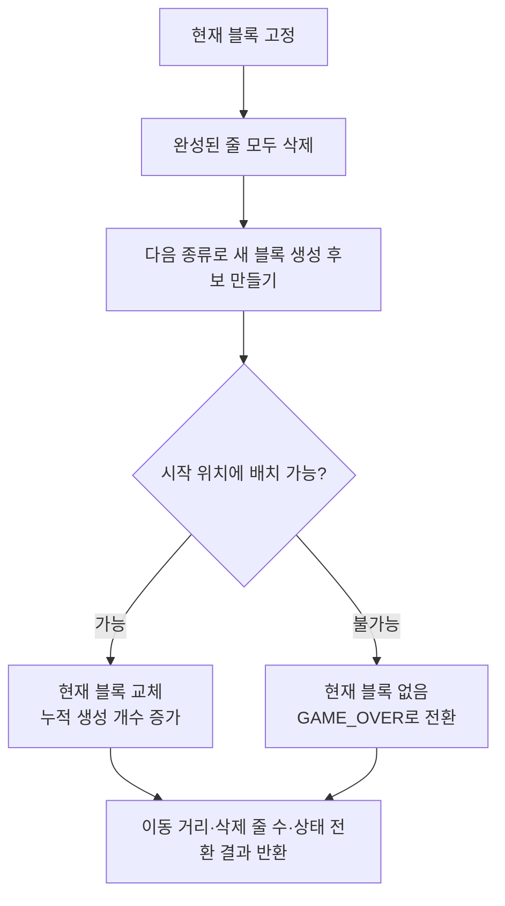

# 게임 엔진: 호출, 상태 조회와 확장

`GameEngine`은 행동을 받아 게임을 변경한다. `GameActionResult`는 **그 행동에서 일어난 일**을,
`GameState`는 **조회 시점의 전체 상태**를 제공한다. 앱 제어는 결과로 점수와 속도를 계산하고,
화면에는 계산 결과가 반영된 상태를 전달한다.

현재 생성·삭제 가속 기준과 점수 반영 순서는 [낙하 속도 작업 기록](../work-items/gameplay-speed.md)에 기록한다.

보드 값과 블록 내부 좌표는 [보드와 블록 문서](board-and-piece.md)를 먼저 참고하면 된다.

## 1. 연결 구조와 클래스 역할



| 타입 | 역할 | 수정할 때 보는 곳 |
|---|---|---|
| `GameEngine` | 게임 상태 변경과 행동 처리 | 행동 분기와 이동·회전·고정 메서드 |
| `GameAction` | 입력과 자동 낙하의 공통 행동 이름 | 입력 변환과 엔진의 행동 분기 |
| `GamePhase` | 시작 전·진행·일시정지·게임오버 구분 | 입력 허용, 루프 제어, 화면 표시 |
| `GameState` | 조회 시점의 독립된 상태 사본 | 화면과 점수·속도 계산에 필요한 조회값 |
| `GameActionResult` | 한 행동의 이동·고정·삭제·생성·상태 전환 결과 | 점수 계산과 게임오버 후처리 |
| `PieceSpawnPolicy` | 생성 위치 규칙의 인터페이스 | 다른 시작 위치를 적용할 때 구현 |
| `CenteredPieceSpawnPolicy` | 보드 위쪽 가운데에서 생성하는 기본 규칙 | 기준 위치 계산 |

상태 변경은 엔진이 맡는다. 입력·타이머·화면에서는 엔진의 보드를 직접 바꾸지 않는다.
입력과 자동 낙하 호출은 한 실행 흐름에서 순서대로 전달한다. 여러 실행 흐름의 동시 변경은
지원하지 않는다. Swing 화면 변경은 Swing 이벤트를 처리하는 실행 흐름에서 수행한다.

## 2. 처음 연결할 때 필요한 메서드

| 메서드 | 반환값 | 역할 |
|---|---|---|
| `newGame()` | 없음 | 보드·목록·점수·레벨·누적 수치를 초기화하고 첫 블록 생성 |
| `apply(GameAction action)` | `GameActionResult` | 행동 한 번 처리 |
| `state()` | `GameState` | 현재 상태의 독립된 사본 조회 |
| `isGameOver()` | `boolean` | 현재 진행 상태가 게임오버인지 조회 |
| `updateScoreAndLevel(long score, int level)` | 없음 | 외부에서 계산한 점수·레벨 반영 |

### 새 게임과 한 칸 하강

새 엔진은 `READY` 상태이다. `newGame()` 이후부터 게임 행동이 적용된다.
다음 예시는 실제 엔진만으로 실행할 수 있다.

```java
import java.util.Random;
import tetris.game.GameAction;
import tetris.game.GameActionResult;
import tetris.game.GameEngine;
import tetris.game.GamePhase;
import tetris.game.GameState;

GameEngine engine = new GameEngine(new Random(21L));
assert engine.state().phase() == GamePhase.READY;

engine.newGame();
int startingRow = engine.state().currentRow();
GameActionResult result = engine.apply(GameAction.DOWN);
GameState state = engine.state();

assert state.phase() == GamePhase.RUNNING;
assert state.currentRow() == startingRow + 1;
assert result.droppedRows() == 1;
assert !result.pieceLocked();
assert state.score() == 0;
```

엔진은 점수를 계산하지 않는다. 초기 점수는 0, 레벨은 1이며, 앱이 계산한 값을 별도로 반영한다.
아래는 계산이 끝난 점수 120과 레벨 2를 전달하는 예시이다.

```java
import tetris.game.GameEngine;

GameEngine engine = new GameEngine();
engine.newGame();
engine.updateScoreAndLevel(120, 2);

assert engine.state().score() == 120;
assert engine.state().level() == 2;
```

점수가 음수이거나 레벨이 1보다 작으면 `IllegalArgumentException`을 발생시키고 두 값 모두
유지한다. 게임오버 이후에도 마지막 점수·레벨을 반영할 수 있다.

### 생성자 선택

| 생성자 | 사용할 상황 |
|---|---|
| `GameEngine()` | 기본 무작위 선택과 가운데 생성 |
| `GameEngine(RandomGenerator)` | 생성 순서를 재현하는 테스트 |
| `GameEngine(Supplier<PieceQueue>, PieceSpawnPolicy)` | 목록 개수나 생성 위치 규칙 교체 |

무작위 선택기, 목록 공급자, 시작 위치 규칙이 `null`이면 예외로 거부한다.
목록 공급자는 새 게임마다 새 `PieceQueue`를 반환해야 한다.

## 3. `GameState`: 화면과 다른 모듈이 읽는 값

`state()`는 호출한 시점의 사본이다. 이후 엔진을 움직여도 이전 사본은 바뀌지 않는다.
한 번의 화면 갱신에서는 사본 하나를 받아 아래 값을 함께 읽는다.

| 메서드 | 값과 사용 방법 |
|---|---|
| `board()` | 고정된 칸만 들어 있는 `Board` 사본. `snapshot()`으로 배열 읽기 |
| `currentPiece()` | 현재 블록의 종류와 회전된 모양. 시작 전·게임오버에서는 `null` |
| `currentRow()` | 회전 기준 정사각형의 왼쪽 위가 놓이는 보드 행 |
| `currentColumn()` | 회전 기준 정사각형의 왼쪽 위가 놓이는 보드 열 |
| `nextPieces()` | 수정할 수 없는 다음 종류 목록. 첫 원소가 다음 생성 대상 |
| `phase()` | 게임 진행 상태 |
| `score()` | 앱에서 반영한 점수 |
| `level()` | 앱에서 반영한 레벨 |
| `spawnedPieces()` | 첫 블록을 포함한 생성 성공 누적 개수 |
| `totalClearedRows()` | 현재 게임에서 삭제한 줄의 누적 개수 |

생성에 실패한 블록은 누적 생성 개수에 포함하지 않는다. 시작 전에는 다음 목록이 비어 있다.
현재 블록이 `null`이면 행·열로 그리기를 시도하지 않는다.

### 사본을 변경해도 엔진은 유지된다

```java
import java.util.Arrays;
import tetris.board.Board;
import tetris.game.GameAction;
import tetris.game.GameEngine;
import tetris.game.GameState;

GameEngine engine = new GameEngine();
engine.newGame();
engine.apply(GameAction.HARD_DROP);
GameState state = engine.state();
int[][] storedCells = state.board().snapshot();

Board copiedBoard = state.board();
copiedBoard.reset();

assert copiedBoard.snapshot()[19][3] == 0;
assert state.spawnedPieces() == 2;
assert engine.state().spawnedPieces() == 2;
assert Arrays.deepEquals(storedCells, engine.state().board().snapshot());
```

`board()`는 독립 보드, `nextPieces()`는 수정할 수 없는 목록이다. 현재 블록도 생성 후 바뀌지 않는
모양 객체이다. 사본은 조회·그리기·독립 계산에 사용하고, 게임 변경은 `apply()`로 전달한다.

## 4. `GameActionResult`: 이번 행동에서 일어난 일

`GameActionResult`는 값을 보관하는 `record` 타입이다. 각 값은 같은 이름의 메서드로 읽는다.
예를 들어 하강 칸 수는 `result.droppedRows()`로 조회한다.

| 메서드 | 의미 |
|---|---|
| `changed()` | 위치·모양·보드·진행 상태·생성 결과가 변경되었는지 |
| `droppedRows()` | 이번 행동에서 현재 블록이 실제로 내려간 칸 수 |
| `clearedRows()` | 이번 행동에서 삭제된 줄 수 |
| `pieceLocked()` | 이번 행동에서 현재 블록이 고정되었는지 |
| `pieceSpawned()` | 이번 행동에서 다음 블록 생성이 성공했는지 |
| `previousPhase()` | 행동 처리 전 진행 상태 |
| `currentPhase()` | 행동 처리 후 진행 상태 |
| `becameGameOver()` | 이번 행동에서 게임오버로 전환했는지 |

하강·삭제 수치가 음수이거나 진행 상태가 없는 결과는 생성할 수 없다.
`changed()`는 엔진의 행동 처리에 대한 값이며, 그 뒤 앱이 반영하는 점수·레벨 변경을 포함하지 않는다.

### 하강과 고정은 구분해서 읽는다

| 행동 상황 | 하강 칸 수 | 고정 | 다음 생성 |
|---|---:|---|---|
| 좌우 이동 또는 회전 성공 | 0 | 아니요 | 아니요 |
| 자동·수동 한 칸 하강 성공 | 1 | 아니요 | 아니요 |
| 바닥에서 다시 하강 | 0 | 예 | 성공 여부에 따라 |
| 즉시 낙하 | 실제 이동 거리 | 예 | 성공 여부에 따라 |
| 경계·충돌·진행 상태로 행동 거부 | 0 | 아니요 | 아니요 |

O 회전은 차지하는 칸이 같아 `changed()`가 `false`이다. 즉시 낙하는 이동 거리가 0이어도 고정한다.
게임오버로 전환되더라도 마지막 행동의 하강 칸 수와 삭제된 줄 수는 유지된다.

```java
import tetris.game.GameAction;
import tetris.game.GameActionResult;
import tetris.game.GameEngine;
import tetris.piece.PieceType;

GameEngine engine = new GameEngine();
engine.newGame();
int expectedDroppedRows = engine.state().currentPiece().type() == PieceType.I ? 19 : 18;
GameActionResult result = engine.apply(GameAction.HARD_DROP);

assert result.droppedRows() == expectedDroppedRows;
assert result.pieceLocked();
assert result.pieceSpawned();
assert result.clearedRows() == 0;
```

## 5. 행동과 진행 상태

### 행동 이름

| 행동 | 처리 |
|---|---|
| `LEFT`, `RIGHT` | 기준 열을 한 칸 이동. 경계·고정된 블록과 겹치면 유지 |
| `DOWN`, `TICK` | 같은 한 칸 하강 처리. 내려갈 수 없으면 고정 |
| `ROTATE_CLOCKWISE` | 같은 기준 위치에서 회전 후보 검사 |
| `HARD_DROP` | 가장 아래 배치 가능한 위치까지 이동한 뒤 고정 |
| `TOGGLE_PAUSE` | 진행과 일시정지 사이 전환 |
| `QUIT` | 엔진에서 무시. 앱 제어에서 종료 처리 |

`null` 행동은 `NullPointerException`으로 거부한다. 유효한 행동이 현재 상태에서 허용되지 않으면
예외 없이 변경 없는 결과를 반환한다.

### 상태 전환



그림은 기본 생성 규칙의 흐름이다. 교체한 시작 위치 규칙으로 첫 생성이 실패하면 `newGame()`
직후에도 게임오버가 될 수 있으므로, 앱은 새 게임 뒤 상태를 확인한다.

| 현재 상태 | 게임 행동 허용 |
|---|---|
| `READY` | 모두 무시. 새 게임으로 시작 |
| `RUNNING` | 이동·회전·하강·즉시 낙하·일시정지 |
| `PAUSED` | 일시정지 전환으로 재개. 나머지 행동 무시 |
| `GAME_OVER` | 모두 무시. 새 게임으로 재시작 |

일시정지는 위치·모양·보드·다음 목록을 유지한다. 엔진은 낙하 시간을 관리하지 않으므로,
앱 제어에서 게임 루프도 정지·재개해야 한다.

```java
import tetris.game.GameAction;
import tetris.game.GameActionResult;
import tetris.game.GameEngine;
import tetris.game.GamePhase;

GameEngine engine = new GameEngine();
engine.newGame();
int startingRow = engine.state().currentRow();
engine.apply(GameAction.DOWN);
engine.apply(GameAction.TOGGLE_PAUSE);
GameActionResult ignored = engine.apply(GameAction.TICK);

assert engine.state().phase() == GamePhase.PAUSED;
assert engine.state().currentRow() == startingRow + 1;
assert !ignored.changed();

engine.apply(GameAction.TOGGLE_PAUSE);
engine.apply(GameAction.TICK);
assert engine.state().currentRow() == startingRow + 2;
```

## 6. 고정부터 게임오버까지

일반 하강은 한 칸 내려갈 수 있으면 위치만 바꾼다. 바닥에 도달한 뒤 다음 하강 행동에서 고정한다.
별도의 고정 대기 시간은 없다. 즉시 낙하는 같은 행동에서 이동과 고정을 끝낸다.



기본 시작 위치의 기준 행은 I가 -1, 나머지 여섯 종류가 0이다. 초기 I의 실제 칸은 내부 행 1에
있으므로 기준 행 -1을 더하면 보드 행 0에 놓인다. 모든 종류의 가장 위쪽 칸이 첫 행에서 나타난다.
기준 열은 `(Board.COLUMNS - piece.rotationSize()) / 2`로 계산한다.

I의 4×4 회전 기준과 내부 모양은 유지한다. 기준 행 -1에서 세로로 회전하면 실제 칸 일부가 보드
밖으로 나가므로 회전을 거부한다. 한 칸 하강해 기준 행 0이 되면 회전할 수 있다.
현재 회전은 벽·위쪽 경계에서 위치를 보정하지 않으며 숨겨진 행도 사용하지 않는다.
빈 보드에서 생성 직후 즉시 낙하한 거리는 I가 19칸, 나머지 종류가 18칸이다.

게임오버 후 들어오는 행동은 변경 없는 결과를 반환한다. `becameGameOver()`는 다시 `true`가 되지
않으므로 같은 게임오버에 랭킹 후처리를 반복하지 않을 수 있다. `newGame()`에는 행동 결과가
없으므로 첫 생성 실패 확인에는 `isGameOver()` 또는 `state().phase()`를 사용한다.

## 7. 다른 파트에서 연결할 순서

### 2번: 입력과 자동 낙하

화면 키는 `InputHandler`와 `KeyMapper`에서 `GameAction`으로 바꿔 앱 제어에 전달한다.
자동 낙하는 정해진 간격마다 `TICK`을 앱 제어에 전달한다. 두 경로 모두 엔진 호출은
`AppController`가 맡는다.

### 3번: 점수·속도·루프·랭킹

1. 종료·메뉴 요청은 앱에서 먼저 처리한다.
2. 행동 전 레벨과 낙하 간격 등 점수 계산에 필요한 값을 보관한다.
3. `engine.apply(action)`으로 처리 결과를 받는다.
4. 하강 칸 수·삭제된 줄 수를 점수 시스템에 전달하고 점수·레벨을 계산한다.
5. `engine.updateScoreAndLevel(score, level)`로 계산 결과를 반영한다.
6. `spawnedPieces()`와 `totalClearedRows()`로 다음 낙하 간격을 계산한다.
7. 상태 전환에 맞춰 루프를 정지·재개한다. 게임오버에서는 루프를 중지한다.
8. 게임오버 전환이면 최종 점수로 랭킹 조건을 판단하고 이름 입력·등록·화면 전환을 진행한다.
9. 계산이 끝난 `engine.state()`를 화면에 전달한다.

마지막 행동의 점수 반영을 마친 뒤 랭킹을 처리해야 한다. 행동으로 새 블록이 생성되어 속도가
바뀌더라도, 방금 하강한 점수에 적용할 기준은 점수 규칙에서 결정한다.

### 4번: 화면 표시

`GameScreen.render(state)`에서 보드 사본, 현재 블록과 기준 위치, 다음 목록, 점수·레벨·진행 상태를
읽는다. 현재 블록이 없으면 그리기를 생략하고, 일시정지는 진행 상태로 표시한다.
메뉴의 방향키·선택·뒤로가기는 화면에서 처리한다.

현재 입력·루프·점수 시스템과 실제 상태 그리기 연결은 미구현이다. 이 절의 순서는 각 파트가
연결할 기준이며, 현재 창에서 자동으로 실행되는 동작은 아니다.

## 8. 기능을 확장하는 방법

엔진의 내부 변수는 `private`이며, 상태 사본의 값은 변경할 수 없다. 변경 책임을 한곳에 두면
다른 파트는 조회 메서드를 유지한 채 내부 구현을 바꿀 수 있다.
`GameEngine`과 `GameState`는 `final` 클래스이며, 생성자에서 전달하는 객체를 교체해 확장한다.

### 시작 위치 규칙 교체

다음 클래스는 기본 규칙의 생성 행을 유지하면서 블록을 보드 왼쪽에서 생성한다.
기존 엔진을 상속하거나 수정할 필요 없이 `PieceSpawnPolicy`의 두 메서드를 구현한다.

```java
import java.util.Objects;
import tetris.game.CenteredPieceSpawnPolicy;
import tetris.game.PieceSpawnPolicy;
import tetris.piece.Tetromino;

public final class LeftAlignedPieceSpawnPolicy implements PieceSpawnPolicy {
    private final PieceSpawnPolicy defaultSpawnPolicy = new CenteredPieceSpawnPolicy();

    @Override
    public int startingRow(Tetromino piece) {
        return defaultSpawnPolicy.startingRow(piece);
    }

    @Override
    public int startingColumn(Tetromino piece) {
        Objects.requireNonNull(piece, "생성할 블록이 필요합니다.");
        return 0;
    }
}
```

생성 위치는 회전 기준 정사각형의 왼쪽 위이다. 실제 네 칸이 보드 밖이면 엔진은 생성 실패로
처리한다. 위 클래스를 만든 다음 다음과 같이 전달한다.

```java
import tetris.game.GameEngine;
import tetris.piece.PieceQueue;

GameEngine engine = new GameEngine(PieceQueue::new, new LeftAlignedPieceSpawnPolicy());
engine.newGame();

assert engine.state().currentColumn() == 0;
```

기본 규칙은 `startingRow()`에서 I는 -1, 나머지 종류는 0을 반환한다.
`startingColumn()`은 가운데 기준 열을 반환한다. 생성 위치 규칙을 바꿀 때도 실제 칸이 모두
보드 안에 있어야 한다. 다른 종류의 기준 행까지 -1로 바꾸면 첫 생성이 실패할 수 있다.

### 미리보기 개수를 세 개로 변경

목록 공급자는 엔진이 새 게임마다 호출하는 객체이다. 아래 예시는 호출할 때마다 새 목록과
무작위 선택기를 만든다.

```java
import java.util.Random;
import tetris.game.CenteredPieceSpawnPolicy;
import tetris.game.GameEngine;
import tetris.piece.PieceQueue;

GameEngine engine = new GameEngine(
        () -> new PieceQueue(new Random(21L), 3),
        new CenteredPieceSpawnPolicy());
engine.newGame();

assert engine.state().nextPieces().size() == 3;
```

같은 초기값으로 선택기를 새로 만들기 때문에 재시작마다 생성 순서가 재현된다.
`GameEngine(RandomGenerator)`에 선택기를 한 번 전달한 경우에는 재시작해도 그 선택기의 상태를
이어 사용한다. 실행마다 다른 선택이 필요하면 공급자 안에서 `RandomGenerator.getDefault()`를
사용할 수 있다.

### 객체 교체로 가능한 변경과 코드 수정이 필요한 변경

| 변경 | 방법 | 함께 확인할 내용 |
|---|---|---|
| 생성 위치 | `PieceSpawnPolicy` 구현 교체 | 빈 부분·경계·첫 생성 실패 테스트 |
| 미리보기 개수 | 목록 공급자의 `PieceQueue` 생성자 값 변경 | 목록 길이, 다음 순서, 화면 배치 |
| 재현 가능한 생성 순서 | 무작위 선택기 전달 | 같은 초기값·재시작 동작 |
| 새로운 게임 행동 | `GameAction`과 `GameEngine.apply()` 분기 수정 | 입력 변환과 상태별 허용 테스트 |
| 회전 위치 보정 | `rotateClockwise()`의 후보 검사 확장 | 벽·바닥·기존 블록, 원본 유지 |
| 새로운 진행 상태 | `GamePhase`와 허용 규칙 수정 | 루프 제어, 화면 표시, 후처리 |
| 상태·결과의 새 정보 | `GameState` 또는 `GameActionResult`의 값·조회 메서드 수정 | 생성 지점, 점수·화면 소비 코드 |
| 일곱 종류를 한 묶음으로 섞는 선택 방식 | `PieceQueue` 선택 구조와 관련 연결 수정 | 확률 요구사항, 연속 선택, 다음 목록 |

현재 `PieceQueue`는 독립 균등 선택을 사용하는 `final` 클래스이다. 목록 공급자를 전달하는 것만으로
새 선택 알고리즘을 구현할 수는 없다. 선택 알고리즘까지 교체해야 할 때는 공통 공급 인터페이스를
도입하는 변경을 별도로 설계한다.

확장 후에는 [엔진 작업 기록](../work-items/game-engine.md)의 완료 기준과 관련 유닛 테스트를
함께 갱신한다.
