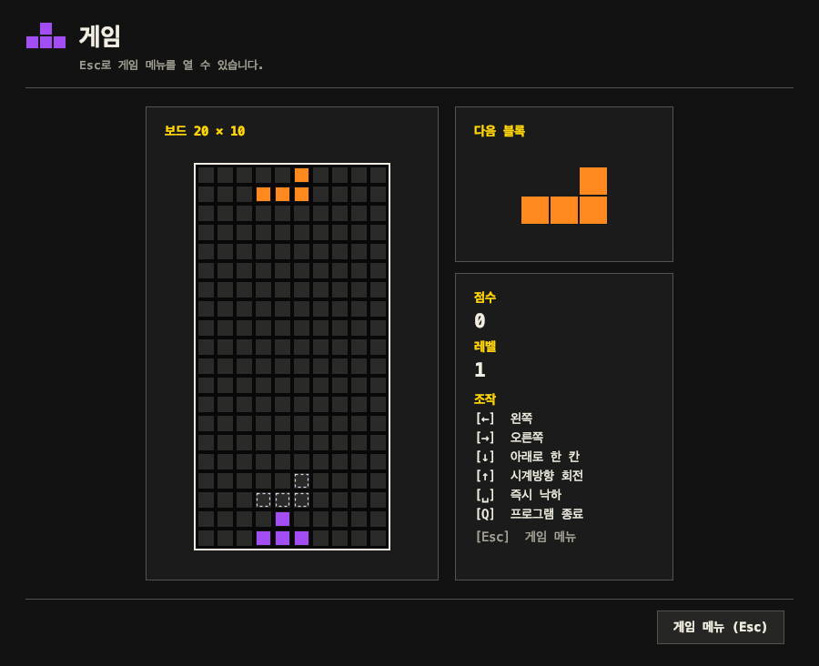

# 다음 블록 배치와 게임 화면 검증

작업 ID: `GAME-PREVIEW-01` · 검증일: 2026-10-09.
브랜치: `integration/pr-7-8-11` · 관련 PR: [#14](https://github.com/dark-ran/tetris-team-project/pull/14).
외부 Issue 미등록, 로컬 구현·검증 기록이다. 원격 push와 PR 수정은 하지 않았다.

## 요구사항·논의·결과

[요구사항 3절](../requirements.md#3-기본-테트리스-게임)의 다음 블록 표시는 기존 화면에 있었지만,
점수·레벨 아래의 작은 표식이라 게임 중 확인하기 어려웠다.
사용자가 제시한 화면처럼 **보드 오른쪽 상단의 독립된 미리보기 박스 → 점수 → 레벨 → 조작 안내**로 배치한다.
보드와 정보 패널을 함께 가운데 정렬하고 가까운 간격으로 유지한다.
기존 테마·색각 팔레트·패턴을 사용하며, 예시 이미지의 배경·블록 그림을 복제하지 않는다.

이 이미지는 실제 Swing 창의 콘텐츠를 그려 저장한 검증 산출물이다. OS 화면 캡처와는 구분한다.

## 코드와 완료 기준

| 동작 | 코드 | 검증 |
| --- | --- | --- |
| 보드 옆 상단의 별도 박스, 점수·레벨은 그 아래 배치 | `ui/GameScreen.java`의 `playfield`, `boardFrame`, `statusSidebar`, `nextPieceCard` | `GameScreenStateTest.nextPreviewIsLargeAndBesideTheTopOfTheBoardAtEveryWindowPreset` |
| 7종의 실제 다음 블록을 32px 칸으로 중앙 표시, 빈 큐는 비움 | `ui/NextPiecePreview.java` | `GameScreenStateTest.everyNextPieceReplacesThePreviousPreviewAndScoreAndLevelFollowTheSnapshot` |
| 큐가 바뀌면 갱신, 이동·낙하 시 컴포넌트를 누적 생성하지 않음 | `GameScreen.render`, `NextPiecePreview.setPiece` | `GameScreenStateTest.actualQueueAdvancesPreviewAndRepeatedMovementKeepsOnePreview` |
| 색각 설정 변경이 다음 미리보기에도 즉시 반영 | `NextPiecePreview.setAppearance`, 기존 공통 `PieceStyle` | `ColorVisionRenderingTest`에서 5개 모드 × 7종 × 회전·고정·다음 블록 검증 |
| 3개 창 크기에서 보드·미리보기·안내가 화면에 들어감 | 높이는 가변, 보드·오른쪽 패널의 폭과 간격 유지 | 위 배치 테스트 및 `ReviewWindowGameplayTest`의 실제 창·모드 검사 |

게임 화면에 중복 정의된 기본 키는 `GameSettings.DEFAULT_KEY_BINDINGS`로 통일했다.
미리보기에서 매 프레임 `removeAll`·새 컴포넌트 생성·재배치를 하던 처리는 제거했다.
다음 종류가 변경될 때만 모양을 갱신하며, 제목·설정 화면의 작은 표식은 기존 용도를 유지한다.
`GameScreen`의 wildcard import는 사용하는 타입만 명시하도록 정리했다.

## 기능 검증

Java 21에서 일반·모듈 검증은 `./gradlew build jacocoTestReport`로 재생성한다.
새 게임 화면 테스트에는 1,000회 반복 이동 후 큐·미리보기·컴포넌트 수를 확인하는 검사도 포함한다.
기존 Esc 메뉴의 흐림 처리·입력 차단·설정 복귀·게임오버 등 회귀 검사를 유지한다.
기능 검증의 전체 수와 import 검사 결과는 [코드 정리 기록](source-hygiene.md)에 모은다.

GUI를 사용할 수 있는 환경에서는 `./gradlew reviewWindowTest`로 실제 창을 검사한다.
2026-10-09 실행에서 실제 창 검사 9개 중 **8개 통과**했다.
기존 `ReviewWindowTest` 1개는 첫 보드의 키보드 포커스 소유자가 `null`이라 실패했다.
컴퓨터 제어 도구로 확인한 결과 Mac이 잠겨 있어 창의 포커스 검증은 잠금 해제 후 재확인이 필요하다.
따라서 전체 실제 창 테스트 통과로 표시하지 않는다. 새 배치 검사 3개와 크기 유지·취소 검사 5개는 통과했다.

크기 3개 × 색각 모드 5개 이미지: `build/review-gameplay/preset-<0~2>-<mode>.png`.
테스트 보고서: `build/reports/tests/reviewWindowTest/index.html`.
현재 검증은 로컬 macOS 결과이며 원격 CI·Windows·과제 최소 사양 기기는 별도 검증 대상이다.

## 성능 검증

`./gradlew gameplayPerformanceTest`는 기기에 의존하는 측정을 일반 CI와 분리해 실행한다.
실제 `AppController` → 엔진 행동 → 상태 조회 → 게임 화면 그리기를 측정한다.
임시 점수 저장소를 사용하며 게임오버·재시작·큐 변경도 부하에 포함한다.
가장 빠른 자동 낙하 간격인 **100ms 내에 측정의 95%를 처리**하는 것을 로컬 검사 기준으로 두었다.

환경: macOS 26.6.2 · Apple M2 Pro · RAM 16GiB · Temurin Java 21.0.12.1 · Gradle 8.14.4.
크기별 일반·단색 패턴 모드 총 6개 사례, 각 준비 50회 + 측정 300회, **측정 1,800회 모두 수행**.
각 사례의 95백분위 시간이 100ms 미만이며, 반복 플레이 후 화면 컴포넌트 수는 59개로 일정했다.

| 창 크기 | 모드 | 95백분위(ms) | 최대(ms) | 측정 종료 시 사용 힙(MiB) |
| --- | --- | ---: | ---: | ---: |
| Small | 일반 | 0.686 | 4.256 | 38.21 |
| Medium | 일반 | 0.544 | 3.535 | 44.27 |
| Large | 일반 | 0.492 | 0.584 | 50.92 |
| Small | 단색·패턴 | 0.561 | 0.668 | 49.18 |
| Medium | 단색·패턴 | 0.577 | 1.269 | 46.06 |
| Large | 단색·패턴 | 0.618 | 1.253 | 47.06 |

검사는 최대 힙 256MiB로 실행한다. 힙 수치는 JVM 전체 메모리나 최대 사용량이 아니며,
이 측정만으로 RAM 1GB·CPU 1.2GHz 최소 사양 충족을 인증하지 않는다.
화면 그리기는 메모리 이미지에 수행하므로 물리 모니터에 표시되는 지연도 별도 확인해야 한다.
원시 측정 결과는 `build/reports/gameplay-performance/`, JUnit 결과는
`build/reports/tests/gameplayPerformanceTest/index.html`에서 다시 생성할 수 있다.
