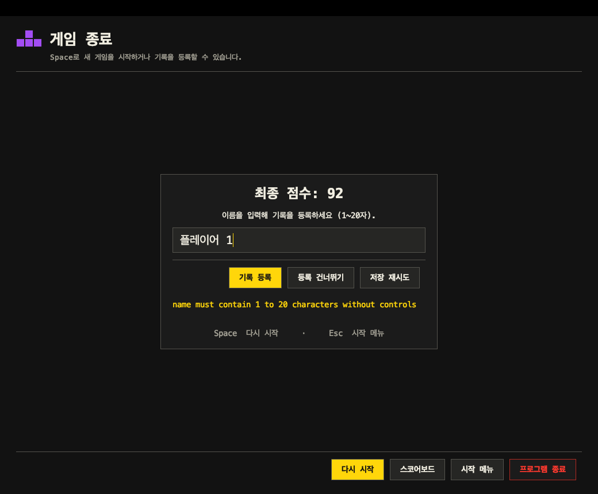

# PR #14 원격 UI 수정과 로컬 변경 통합

작업 ID: `PR14-UI-SYNC-01` · 검증일: 2026-10-10.
브랜치: `integration/pr-7-8-11` · 관련 PR: [#14](https://github.com/dark-ran/tetris-team-project/pull/14).
원격 변경을 가져와 로컬에 병합했다. 이번 작업은 원격 push·PR 수정·main 병합을 포함하지 않는다.

## 변경 이력과 결정

팀원이 원격에 올린 UI 수정과 아직 push하지 않은 로컬 변경을 함께 적용해 달라는 요청이다.
병합 전 로컬에는 `cb8eeea`까지 8개 커밋, 원격에는 공통 시작점 `5374a1c` 이후 2개 커밋이 있었다.

| 원격 커밋 | 내용 |
| --- | --- |
| `73da63b` | 이름 안내·오류 메시지 잘림 수정, 스켈레톤 문구 제거, 방향키 기호 표시 |
| `c196db9` | 통합 테스트의 방향키 버튼 이름을 `←`로 수정 |

merge 방식으로 두 이력을 보존한다. 로컬의 색각 5개 모드·독립 패턴, 창 크기 즉시 적용과 유지·취소,
게임오버 입력란·화면 메서드 정리, 기록 초기화, 생성·삭제에 따른 가속, 보드 옆 다음 블록,
미사용 import 검사와 IDE 경로 수정도 함께 유지한다.

## 충돌 해결

| 파일 | 양쪽 변경을 반영한 결과 |
| --- | --- |
| `GameOverScreen` | 로컬의 어두운 20pt·너비 440 입력란과 분리한 메서드 유지. 안내는 폼 전체 너비에서 가운데 정렬하고, 원격의 읽기 전용·줄바꿈 오류 영역을 연결. 긴 메시지가 카드를 넓히지 않도록 폭을 제한 |
| `GameScreen` | 로컬의 보드 옆 다음 블록·점수·레벨 배치와 작은 창의 안내 간격 유지. 방향키는 원격의 공통 `SwingKeyBindings.keyText`로 표시 |
| `SettingsScreen` | 로컬의 색각 모드·독립 패턴·크기 확인 기능 유지. 키 입력 대기·변경·설정 재조회 모두 같은 방향키 기호로 표시 |

프로그램 제목 `Tetris`와 첫 화면의 스켈레톤 문구 삭제, 통합 테스트의 `←` 버튼 조회는 원격 변경을 그대로 반영했다.
실제 키 코드와 입력 동작은 유지한다. 공개 API 이름을 바꾸지 않았다.

## 검증

Java 21 / macOS에서 이전 빌드 결과를 제거하고 다음을 실행했다.

```sh
./gradlew clean build jacocoTestReport gameplayPerformanceTest reviewWindowTest
```

| 검사 | 결과 |
| --- | --- |
| 일반 테스트 | 346개 통과 |
| 실제 모듈 통합 | 1개 통과 |
| 성능 측정 사례 | 6개 통과, 입력·상태 조회·그리기 1,800회 |
| 실제 창 검사 | 9개 통과 |
| 합계 | **362개 통과**, 실패·오류·건너뛰기 0 |
| 미사용 import 검사 | 소스 81개 파일, 미사용 0개 |
| 기존 클래스별 줄 커버리지 기준 | 보드·블록·엔진 70% 기준 통과 |

추가 회귀 검사는 세 창 크기에서 안내의 전체 표시와 가운데 정렬, 긴 영어·한국어 오류 메시지의
각 문자·줄이 영역 안에 들어가는지, 오류 때문에 입력 카드가 넓어지지 않는지 확인한다.
방향키를 다른 키로 지정한 뒤 설정을 다시 불러와도 색각·패턴·키 표시가 유지되는지 검사한다.
기존 실제 창 검사에는 빈 이름을 등록해 오류가 나타난 뒤 끝 문자까지 보이는지 확인하는 절차를 추가했다.

2026-10-09의 잠긴 Mac에서 실패했던 첫 보드 포커스 검사도 이번 실행에서는 통과했다.
실제 포커스 소유자를 통한 이름 공백 입력, Esc 복귀, Space 재시작, 기록 초기화와 창 닫기 검증을 완료했다.
외부 OS 키 입력 주입, Windows·원격 CI·과제 최소 사양 검증은 이번 로컬 결과에 포함되지 않는다.



이미지는 실제 Swing 창의 내용을 그려 저장했다. 다음 블록·방향키 안내와 크기 유지 확인 화면도 생성 이미지로 확인했다.
보고서는 `build/reports/tests/{test,reviewIntegrationTest,gameplayPerformanceTest,reviewWindowTest}/`와
`build/reports/jacoco/test/html/`, 성능 원시 결과는 `build/reports/gameplay-performance/`에서 재생성할 수 있다.

기존 로컬 커밋과 원격 커밋은 Git 이력에서 각각 추적할 수 있으며, 충돌 해결·테스트·이 문서는 후속 병합 커밋에 함께 보관한다.
